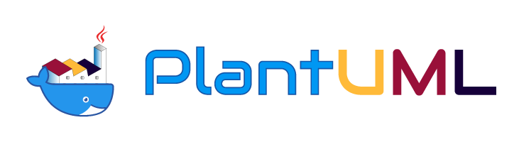

	 
	

		
	

	 
	

		
    

# Docker containers for PlantUML
All dockers files for PlantUML

## Preamble

This is a [monorepo](https://github.com/joelparkerhenderson/monorepo-vs-polyrepo) of containers used by PlantUml CI or hosting PlantUml.

Commits are written following the 
[Conventional Commits](https://www.conventionalcommits.org/en/v1.0.0/).

Release are provided using the [release-please-action](https://github.com/google-github-actions/release-please-action) action with the [manifest releaser](https://github.com/googleapis/release-please/blob/main/docs/manifest-releaser.md).

## List of containers

- ### [graalvm](graalvm/README.md)

- ### [jekyll](jekyll/README.md)

## Adding new container

Details are in [Adding new container document](docs/adding-new-container.md).

## Howto create a pull request

Details are in [Howto create a pull request](docs/howto-create-a-pull-request.md).
