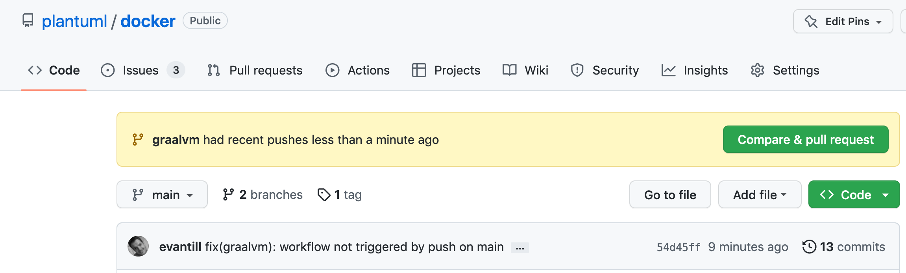
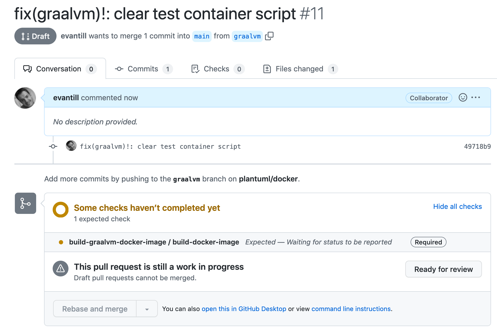
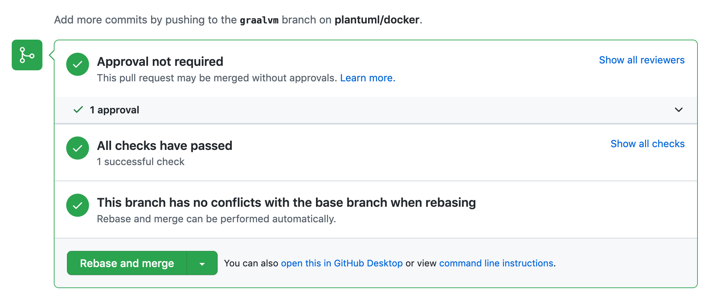
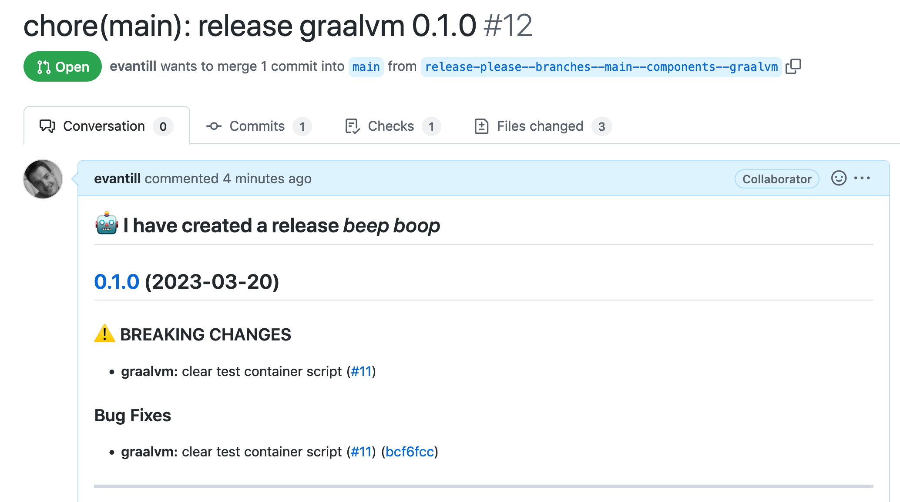

# Howto create a pull request

The main branch is protected againt direct push to assure a clean release workflow.

Some informations about branch protection :

- [About protected branches](https://docs.github.com/en/repositories/configuring-branches-and-merges-in-your-repository/defining-the-mergeability-of-pull-requests/about-protected-branches)
- [Disable a direct push to GitHub main branch](https://dev.to/pixiebrix/disable-a-direct-push-to-github-main-branch-8c2)

## push request scenario

To create a PR for a the component `graalvm`

## create a branch `graalvm`

```shell
gh repo clone plantuml/docker
cd docker

git switch -c  graalvm
```

After updating the code we will push the branch to github.

## push to origin

```shell
 git push --set-upstream origin graalvm
```

## create a pr

1. On github create a pull request (Compare and pull request).
    

1. Create the pull request.
    > Note: you can create a **draft** pull request

1. this will trigger the build workflow as a check.
    

1. Once checked we can **rebase** and merge (or squash and merge).
    

1. We can delete the branch.

1. The release bot will open a pull request for the release on the main branch.
    

1. Once checked we can **rebase** and merge (or squash and merge).

1. We can delete the branch.

1. The release is completed.